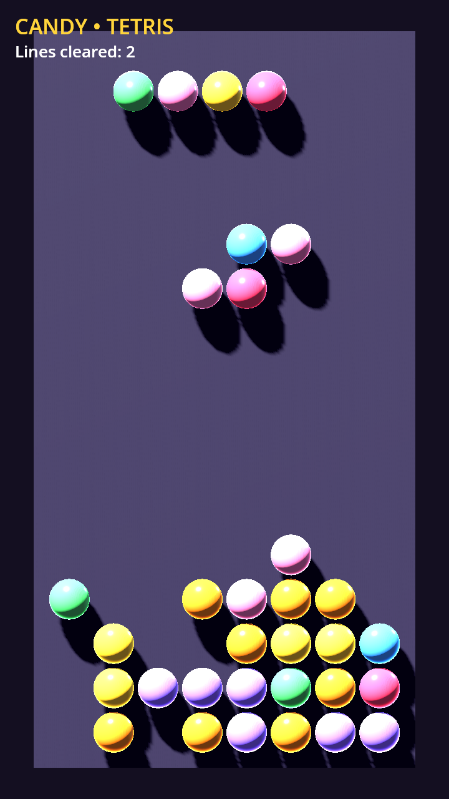
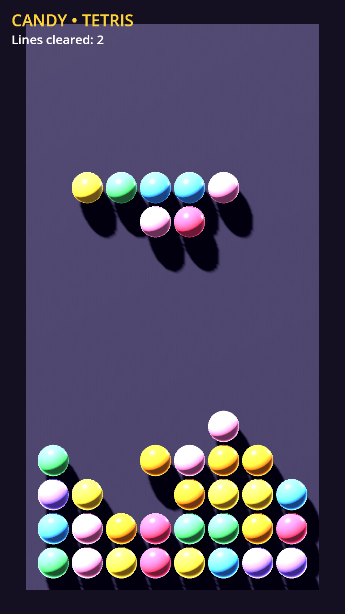
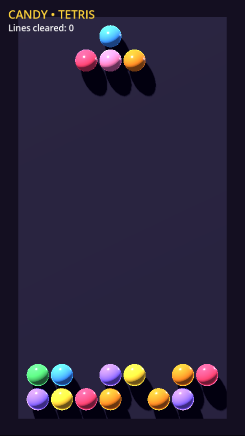

# 🍬 Candy Crush Tetris

A primitive **Candy Crush + Tetris** mash‑up built with **Godot 4.5**: tetromino
pieces made of multicoloured candy balls fall down a well, stack up, and full
rows are cleared. The game is played on a flat 2D playfield, but it is rendered
in a **true 3D scene** (real sphere meshes, lighting and shadows) so the visuals
can be elaborated on later.

There is no human input yet — exactly as requested, this is the most primitive
implementation. Instead, an optional **auto‑player** steers each falling piece
toward the column that keeps the stack flat (this is the *"automatic control of
the falling figures"* from the issue). It can be turned off to let pieces drop
straight down.

| Gameplay | Gameplay (stacking) | Running in the browser |
|---|---|---|
|  |  |  |

## ▶️ Play online

* **GitHub Pages:** `https://<owner>.github.io/<repo>/` — published automatically
  on every push to `main` (see [CI/CD](#-cicd) below). For this repository that
  is <https://jhon-crow.github.io/candy-crush-tetris-godot-game/> once Pages is
  enabled.
* **itch.io:** optional, published via `butler` when configured (see
  [Publishing to itch.io](#publishing-to-itchio)).

## ✨ Features

* 7 classic tetromino shapes (I, O, T, S, Z, J, L), each made of 4 candy balls.
* Random candy colours per ball from a 7‑colour sweet palette.
* Automatic falling on a fixed tick, smooth gliding between cells.
* Locking, **full‑row clearing**, and automatic board reset on overflow.
* Optional heuristic **auto‑player** (genetic-tuned four-feature weights) that
  places pieces.
* Rendered in 3D: orthographic camera, directional key/fill lights, soft
  shadows, glossy candy materials — a 2D game in a 3D scene.
* Exports to **HTML5/Web** (single‑threaded, so it runs on GitHub Pages with no
  special cross‑origin headers).

## 🎮 How it works

The whole scene is built in code from a single‑node scene (`scenes/Main.tscn`
→ `scripts/Game.gd`):

* The playfield is an `8 × 16` grid in the world XY‑plane (`z = 0`). Each ball is
  a `MeshInstance3D` with a `SphereMesh` and its own glossy `StandardMaterial3D`.
* `_process()` advances a fall timer; every `FALL_INTERVAL` seconds `_step()`
  moves the active piece one cell down (and, in auto‑play, one cell toward its
  target column).
* When a piece can no longer move down it is **locked** into the `_settled`
  grid, full rows are cleared (rows above shift down), and a new piece spawns.
* If a freshly spawned piece does not fit, the board is cleared and play resumes.

Toggle the auto‑player from the Inspector on the `Main` node (`auto_play`), or in
code:

```gdscript
$Main.auto_play = false  # pieces drop straight down the centre
```

## 🗂 Project structure

```
project.godot              # Godot 4.5 project, GL Compatibility renderer
export_presets.cfg         # "Web" preset, single-threaded (thread_support=false)
icon.svg                   # candy-ball icon
scenes/Main.tscn           # main scene (Node3D + Game.gd)
scripts/Game.gd            # all gameplay + scene construction + auto-player
tests/test_game_logic.gd   # headless invariant test (run in CI)
experiments/screenshot.gd  # offscreen screenshot capture helper
.github/workflows/         # ci.yml (tests) + deploy.yml (Pages + itch.io)
docs/case-studies/issue-1/ # research & deep-dive case study
docs/screenshots/          # screenshots used above
```

## 🛠 Local development

1. Install [Godot **4.5.x**](https://godotengine.org/download) (standard, not C#).
2. Open the project: `godot --editor project.godot` (or via the project manager).
3. Press **F5** to run, or from a terminal:

   ```bash
   godot project.godot          # opens the editor
   godot --headless --import    # generate import cache (first time)
   ```

### Exporting the Web build locally

```bash
# Install the matching export templates once (Editor → Manage Export Templates,
# or download Godot_v4.5.2-stable_export_templates.tpz).
mkdir -p build/web
godot --headless --export-release "Web" "$PWD/build/web/index.html"

# Serve it (the build needs an HTTP server; file:// will not work):
python3 -m http.server -d build/web 8000
# open http://localhost:8000/
```

The Web preset is exported **single‑threaded** (`variant/thread_support=false`),
so it does **not** require the `SharedArrayBuffer` / COOP+COEP cross‑origin
isolation headers that GitHub Pages cannot set.

## 🧪 Tests

`tests/test_game_logic.gd` drives the fall loop directly for 4000 steps and
asserts the core invariants (the active piece is always valid, settled balls
never overlap or leave the grid, and the spawn → lock → line‑clear loop makes
progress). Run it headlessly:

```bash
godot --headless --script tests/test_game_logic.gd
echo $?   # 0 = pass, non-zero = fail
```

This same test runs in CI on every push and pull request.

## 🚀 CI/CD

Two GitHub Actions workflows live in `.github/workflows/`:

* **`ci.yml`** — downloads Godot and runs the headless logic test on every push
  and PR.
* **`deploy.yml`** — exports the Web build on every push/PR (uploading it as an
  artifact), and on pushes to `main` deploys it to GitHub Pages and, when
  configured, publishes to itch.io.

### Enabling GitHub Pages

1. Push to `main` (or merge this PR).
2. In the repository: **Settings → Pages → Build and deployment → Source** →
   select **GitHub Actions**.
3. The next `main` build deploys to `https://<owner>.github.io/<repo>/`.

### Publishing to itch.io

The itch.io step is **optional** and skipped unless you configure it.

1. **Create the game on itch.io.** Go to <https://itch.io/game/new>, set the
   *Kind of project* to **HTML**, and note the URL slug
   `https://<user>.itch.io/<game>` (the `<game>` part is your `ITCH_GAME`).
2. **Generate an API key.** <https://itch.io/user/settings/api-keys> → *Generate
   new API key*.
3. **Add it as a repository secret.** Repo **Settings → Secrets and variables →
   Actions → Secrets** → new secret named **`BUTLER_CREDENTIALS`** = your API key.
4. **Tell the workflow where to publish.** Same page → **Variables** tab → add:
   * `ITCH_USER` = your itch.io username
   * `ITCH_GAME` = the game slug from step 1
5. Push to `main`. The workflow uploads the Web build with
   `butler push build/web <ITCH_USER>/<ITCH_GAME>:html5`.
6. On the itch.io game's *Edit* page, set the uploaded `html5` build to
   **"This file will be played in the browser"** and save.

> If `ITCH_USER` / `ITCH_GAME` are not set, the `publish-itch` job is skipped and
> the rest of the pipeline still runs.

## 📚 Case study

A deeper write‑up — issue analysis, prior art, libraries, the web‑export /
cross‑origin‑isolation trade‑offs, and design decisions — lives in
[`docs/case-studies/issue-1/`](docs/case-studies/issue-1/README.md).

## License

See the repository for license details.
